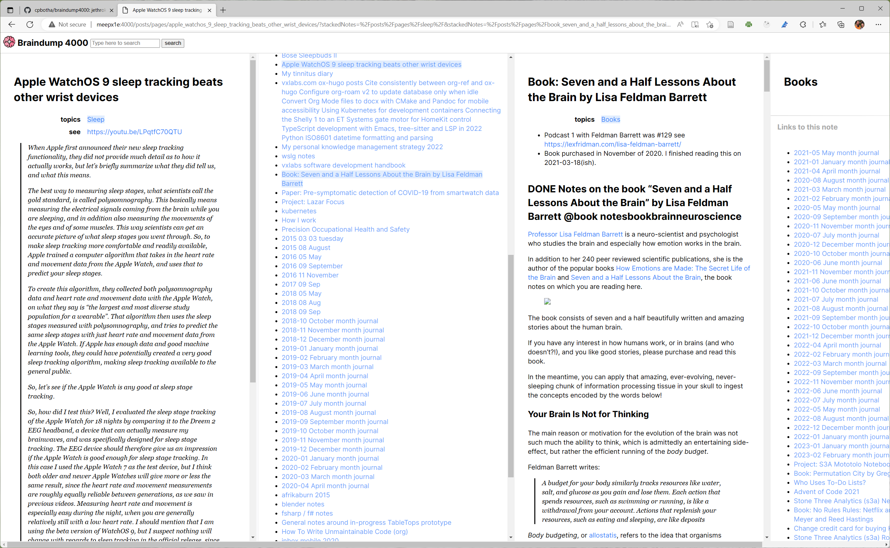
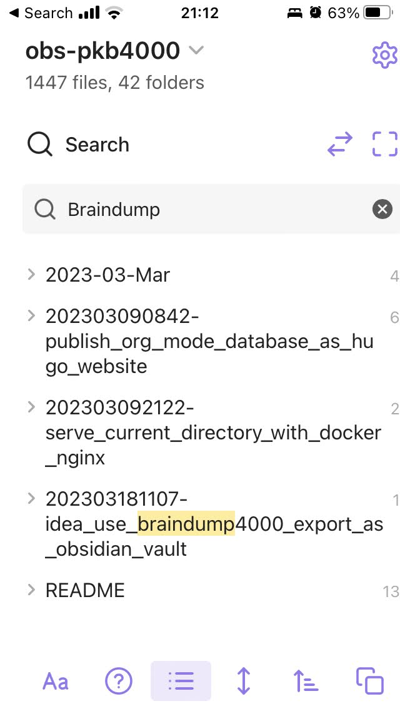
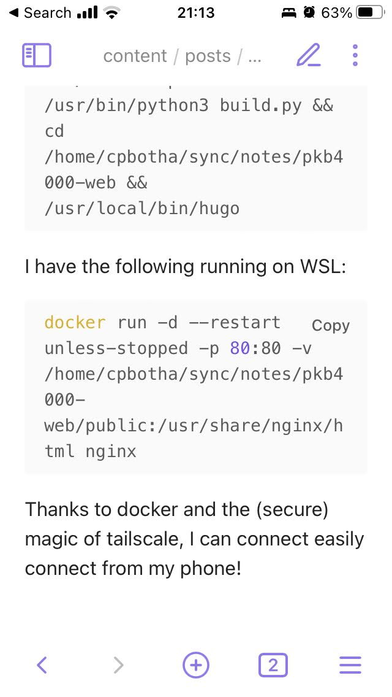
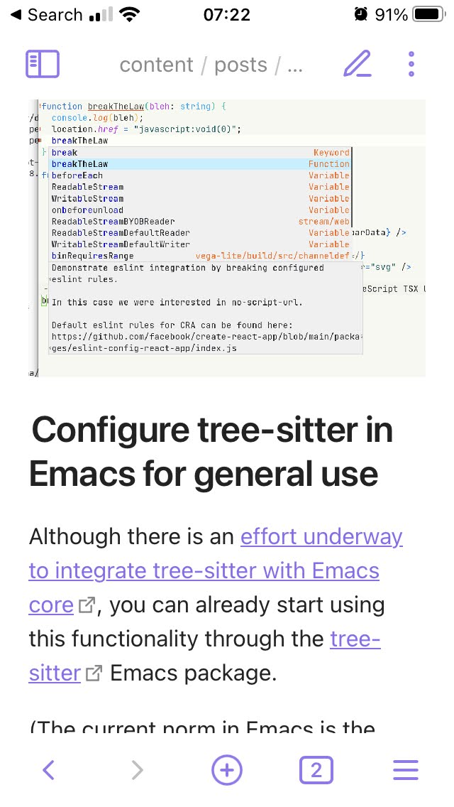
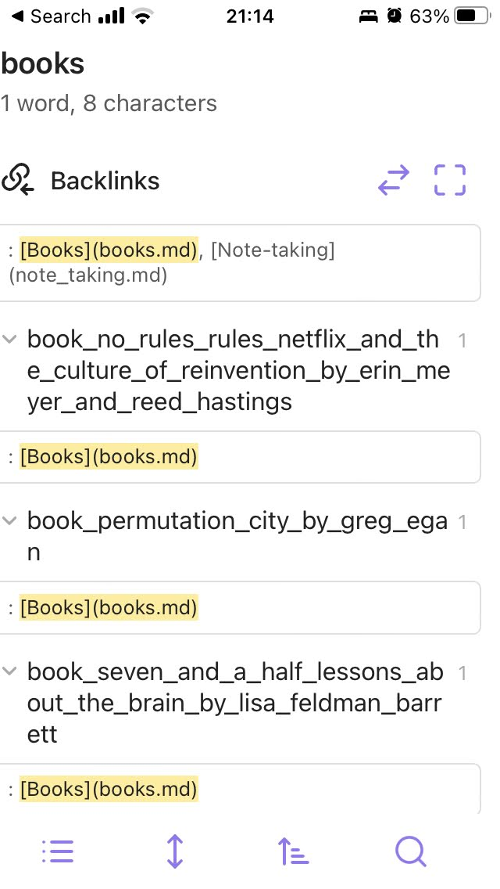

# braindump4000: heavily modified jethrokuan braindump

Convert your nested org mode database with broken links into a Hugo
website.

In addition to nesting and broken links, braindump4000 also deals with
it if you are already using Hugo to publish parts of your org mode
database.

Find the original braindump at <https://github.com/jethrokuan/braindump>

You could also use org-publish, but on my 1000+ file database, that
takes forever, even when most of the files don't have to be republished.

P.S. This tool is now also able to munge that Hugo-destined output for
Obsidian, so that you are able to access your org-mode database using
the Obsidian mobile app.

## Quickstart

Let's say the root directory containing your nested org-mode database is
`~/notes/pkb4000` and you want a Hugo version in `~/notes/web-pkb4000`
then you could do the following:

### Create the hugo website

``` shell
cd ~/notes
hugo new site web-pkb4000
```

Install jethrokuan's [cortex](https://github.com/jethrokuan/cortex)
theme:

``` shell
cd ~/notes/web-pkb4000/themes
git clone https://github.com/jethrokuan/cortex.git
```

Install his
[config.toml](https://github.com/jethrokuan/braindump/blob/master/config.toml)
at the top-level.

Add the root level of the config, add:

``` yaml
refLinksErrorLevel = "WARNING"
```

### Add two important pages

Create `web-pkb4000/content/_index.md` for the front page:

``` markdown
Well hello!

See the [index](posts).
```

Very importantly, create an empty `web-pkb4000/search/_index.md` just so
that your search works.

### Build your site with braindump4000

``` shell
# I usually clone braindump4000 inside my notes database pkb4000
cd notes/pkb4000
git clone https://github.com/cpbotha/braindump4000.git
cd notes/pkb4000/braindump4000
# note that the destination directory is the desired Hugo section within "content"
# for the cortex theme, this must be "posts"
python3 build.py ~/notes/pkb4000 ~/notes/web-pkb4000/content/posts
```

The instructions above are just following my example.

However, as long as you specify your input and output directories
correctly, everything should work for different setups.

## Obsidian support

braindump4000 is also able to transform your org-mode database into an
Obsidian vault.

This is a bit of a hack, but it does yield an Obsidian vault which is
quite usable, including image attachments, backlinks and so on.

This howto is simpler, because we don't need the whole Hugo site, only
something that looks like an Obsidian vault:

``` shell
# I usually clone braindump4000 inside my notes database pkb4000
cd notes/pkb4000
git clone https://github.com/cpbotha/braindump4000.git
cd notes/pkb4000/braindump4000
python3 build.py --obsidian ~/notes/pkb4000 ~/notes/obs-pkb4000/content/posts
```

After this, you can open `~/notes/obs-pkb4000/` as an Obsidian vault.

The markdown in `content/posts/` has been massaged (see
[obs~postproc~.py](./obs_postproc.py) for details) to support Obsidian's
particular expectations, and images generally end up in
`static/ox-hugo`.

Personally, I use [syncthing](https://syncthing.net/) and [Möbius
Sync](https://www.mobiussync.com/) to push the converted vault into
Obsidian's sandbox on my iPhone in order to get mobile access to my Org
mode database.

Note: On the mobile app, remember to activate
`Settings - Editor - Display -
Srict line breaks` as the ox-hugo / markdown generally does add single
line breaks inside paragraphs.

## Obligatory screenshot(s)

In the screenshot below, I started with the Apple WatchOS 9 sleep
tracking video note, from there the Sleep backlinks page, then the Seven
and a Half Lessons about the Brain book notes and finally my Books
backlinks.

[](file:screenshots/apple-watch-sleep-sleep-feldman-books.png)

My braindump site is being served using
[goStatic,](https://github.com/PierreZ/goStatic) tightly bound to a
private [tailnet](https://tailscale.com/) IP.

### Obsidian mobile app

[](screenshots/obs_search.jpg)

[](file:screenshots/obs_code.jpg)

[](file:screenshots/obs_image.jpg)

[](file:screenshots/obs_backlinks.jpg)


## FAQ

### Why is this README markdown and not org?

github's org mode support does not seem to include a way to specify image
display size. See e.g.
https://stackoverflow.com/questions/54926052/github-org-mode-html-export-image-resizing
